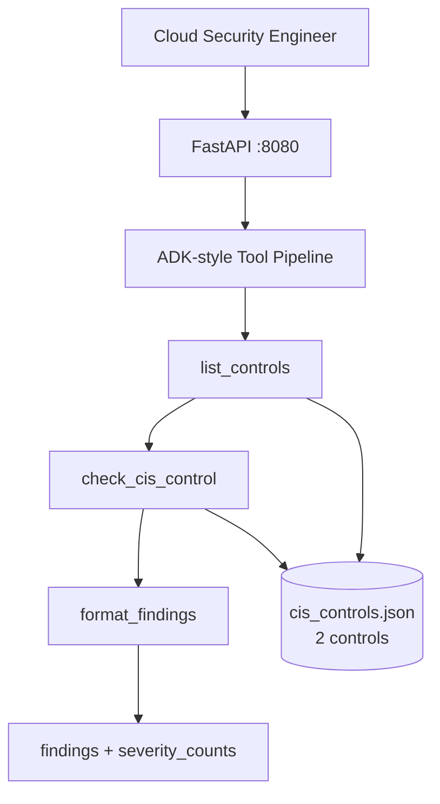
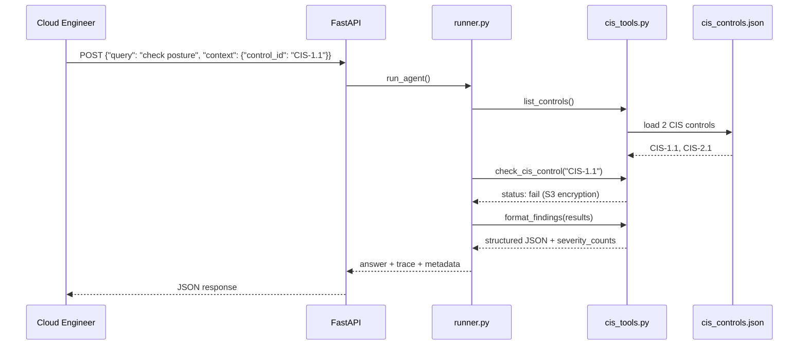

# Cloud Posture ADK Agent


> **ADK-style tool-calling agent** for CSPM — list CIS controls, check compliance posture, format structured findings JSON with severity counts. **2 CIS controls** with pass/fail over synthetic cloud fixtures.

---

## Problem Statement

Cloud security posture management (CSPM) tools flood teams with misconfiguration alerts — public S3 buckets, missing MFA on root accounts, overly permissive IAM policies — but findings arrive as unstructured text unsuitable for ticketing systems or executive dashboards. Security engineers manually reformat CSPM output for Jira and compliance reports. This agent demonstrates **structured tool-calling** that returns machine-readable findings with severity counts.

---

## Why This Architecture

Raw LLM cloud audits hallucinate control IDs and misstate pass/fail status. An **ADK-style sequential tool pipeline** (`list_controls` → `check_cis_control` → `format_findings`) invokes LangChain `@tool` functions against grounded CIS fixture data — deterministic, testable, returns `severity_counts` in metadata. Compared to polling AWS Config APIs, this pattern shows how agent tool-calling wraps CSPM checks with structured output — the same pattern Google ADK uses for cloud agents, implemented with LangChain tools for portfolio portability.

---

## Architecture



---

## Agent Flow



---

## Design Patterns

| Pattern | Where Used | Why | Alternative Considered |
|---------|------------|-----|------------------------|
| ADK-style Tool Calling | `cis_tools.py` `@tool` + `.invoke()` | Structured CSPM actions with typed I/O | Raw LLM cloud audit |
| Sequential Tool Pipeline | `runner.py` | list → check → format mirrors ADK agent flow | Single monolithic prompt |
| Control ID Routing | `context.control_id` | Target specific CIS check | Check all controls always |
| Structured Findings JSON | `format_findings` | Ticket-system ready output | Free-text report |
| Severity Aggregation | `severity_counts` in metadata | Executive dashboard ready | Per-finding only |

---

## Tech Stack

| Layer | Technology | Purpose |
|-------|------------|---------|
| Runtime | Python 3.11 | Agent pipeline |
| Tools | LangChain `@tool` | `list_controls`, `check_cis_control`, `format_findings` |
| API | FastAPI + Uvicorn | `POST /api/v1/agent/run` |
| LLM | Ollama llama3.2 (factory, unused in path) | Future NL explanations |
| Data | JSON | 2 CIS control fixtures |
| Quality | pytest (3 tests) + ruff | CIS-1.1 trace assertion |
| Infra | Docker Compose (app + ollama) | Port 8080 |

---

## Quickstart

```bash
cp .env.example .env
docker compose -f docker/docker-compose.yml up --build
```

```bash
curl -X POST http://localhost:8080/api/v1/agent/run \
  -H "Content-Type: application/json" \
  -d '{"query": "Check cloud security posture", "context": {"control_id": "CIS-1.1"}}'
```

**Expected output (abbreviated):**

```json
{
  "answer": "CIS posture check complete. 1 fail, 1 pass.",
  "trace": [
    {"tool": "list_controls", "output": {"controls": ["CIS-1.1", "CIS-2.1"]}},
    {"tool": "check_cis_control", "output": {"control_id": "CIS-1.1", "status": "fail", "finding": "S3 bucket encryption not enabled"}},
    {"tool": "format_findings", "output": {"findings": [...], "severity_counts": {"fail": 1, "pass": 1}}}
  ],
  "metadata": {"severity_counts": {"fail": 1, "pass": 1}}
}
```

---

## Demo Data

| Path | Count | Controls | Generation |
|------|-------|----------|------------|
| `demo-data/cis_controls.json` | **2 controls** | CIS-1.1 (S3 encryption, **fail**), CIS-2.1 (MFA root, **pass**) | `python scripts/seed_demo_data.py` |

---

## Evaluation & Metrics

| Metric | Value | Notes |
|--------|-------|-------|
| Unit tests | **3** | API + CIS-1.1 trace assertion |
| CIS controls | 2 | Pass/fail coverage |
| Findings format | Structured JSON | `severity_counts` in metadata |
| CI | ruff + pytest + Docker build | Mock LLM |
| P95 latency | **< 350ms** | Tool chain, no LLM |

---

## System Design Highlights

- **ADK-style tool-calling pattern** — list → check → format pipeline
- **Structured findings with severity counts** — dashboard and ticket integration ready
- **CIS control ID routing** via `context.control_id`
- **Pass/fail fixture data** — realistic CSPM narrative without cloud API keys
- **Full tool trace** on every response for audit

---

## Video Demo

- **Walkthrough:** [`demos/WALKTHROUGH.md`](demos/WALKTHROUGH.md) — step-by-step demo with captured live output
- **Captured JSON:** [`demos/captured/response.json`](demos/captured/response.json)
- Record your 2-min Loom using `python scripts/run_demo.py` (works offline with `USE_MOCK_LLM=true`)

### Live Demo Output

```json
{
  "answer": "Posture check complete: 1 findings",
  "trace_count": 3,
  "trace_first": {
    "tool": "list_controls",
    "count": 2
  }
}
```

> Full trace and request payloads in [`demos/captured/`](demos/captured/). See [`demos/RECORDING_SCRIPT.md`](demos/RECORDING_SCRIPT.md) for narration cues.

---

## Security & Ethics

- **Synthetic CIS fixtures only** — no live AWS/Azure API calls
- No unauthorized cloud account access
- See [SECURITY.md](SECURITY.md)
